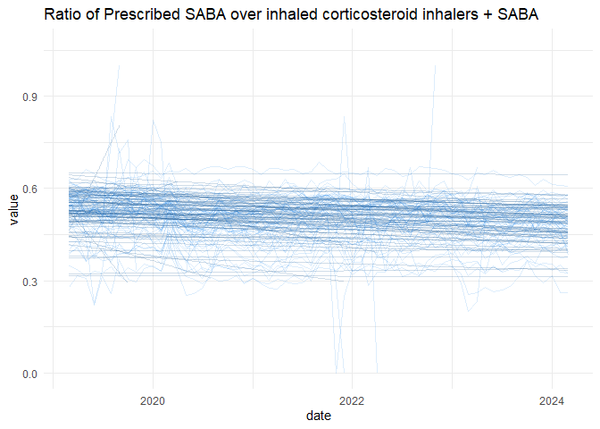
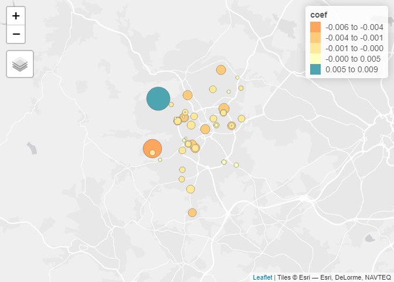
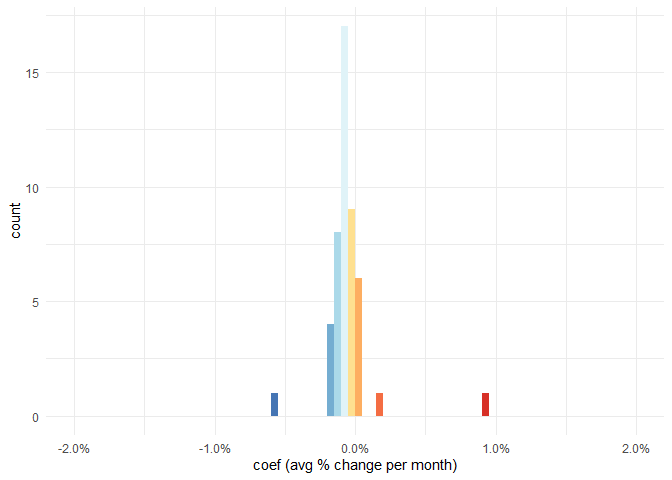
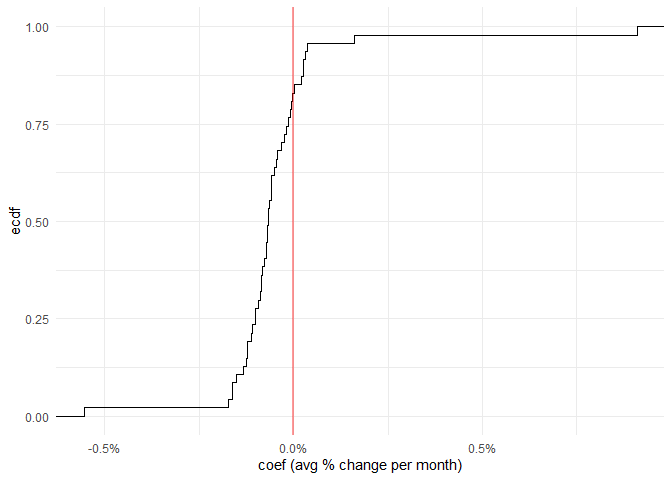
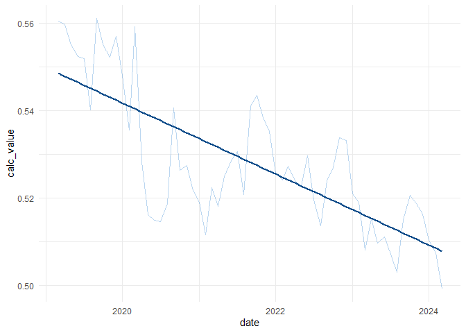

# OpenPrescription EDA
Juan Fonseca

This work is based on data from
[OpenPrescribing](https://openprescribing.net/).

## Obtaining boundaries

``` r
library(sf)
```

    Linking to GEOS 3.11.2, GDAL 3.8.2, PROJ 9.3.1; sf_use_s2() is TRUE

``` r
library(tidyverse)
```

    ── Attaching core tidyverse packages ──────────────────────── tidyverse 2.0.0 ──
    ✔ dplyr     1.1.4     ✔ readr     2.1.5
    ✔ forcats   1.0.0     ✔ stringr   1.5.1
    ✔ ggplot2   3.5.1     ✔ tibble    3.2.1
    ✔ lubridate 1.9.3     ✔ tidyr     1.3.1
    ✔ purrr     1.0.2     

    ── Conflicts ────────────────────────────────────────── tidyverse_conflicts() ──
    ✖ dplyr::filter() masks stats::filter()
    ✖ dplyr::lag()    masks stats::lag()
    ℹ Use the conflicted package (<http://conflicted.r-lib.org/>) to force all conflicts to become errors

``` r
library(tmap)
```

    Breaking News: tmap 3.x is retiring. Please test v4, e.g. with
    remotes::install_github('r-tmap/tmap')

### NHS boundaries

``` r
CCG_boundaries <- geojsonsf::geojson_sf("https://openprescribing.net/api/1.0/org_location/?org_type=ccg") |> st_transform(27700)
```

    Warning in readLines(con): incomplete final line found on
    'https://openprescribing.net/api/1.0/org_location/?org_type=ccg'

## GP surgeries

Approximate locations of all registered GP surgeries can be obtained.
For example, for Bradford (ICB code: `36J)`

``` r
bradford_code <- "36J"
```

Reading the built-up areas data

``` r
builtup_bounds <- st_read("OS Open Built Up Areas.gpkg",
                          layer = "os_open_built_up_areas")
```

    Reading layer `os_open_built_up_areas' from data source 
      `C:\Users\ts18jpf\OneDrive - University of Leeds\03_PhD\00_Misc_projects\Eng-Presc-Data\OS Open Built Up Areas.gpkg' 
      using driver `GPKG'
    Simple feature collection with 8585 features and 7 fields
    Geometry type: MULTIPOLYGON
    Dimension:     XY
    Bounding box:  xmin: 65300 ymin: 10000 xmax: 655625 ymax: 1177650
    Projected CRS: OSGB36 / British National Grid

Selecting the biggest builtup area within the NHS region

``` r
bradford_zones <- builtup_bounds[CCG_boundaries[CCG_boundaries$code==bradford_code,],] |> slice_max(geometry_area_m)
```

``` r
Bradford_Practices <- geojsonsf::geojson_sf(
  paste0("https://openprescribing.net/api/1.0/org_location/?q=",
         bradford_code)
  ) |> st_transform(27700)
```

    Warning in readLines(con): incomplete final line found on
    'https://openprescribing.net/api/1.0/org_location/?q=36J'

``` r
tmap_mode("view")
```

    tmap mode set to interactive viewing

``` r
qtm(Bradford_Practices |> st_make_valid())
```


### Short acting beta agonist inhalers

See: <https://openprescribing.net/measure/saba/definition/>

Taken from the web:

> ***Why it matters:** Why Asthma Still Kills reports that high use of
> short acting beta agonists (salbutamol and terbutaline) and poor
> adherence to inhaled corticosteroids in asthma suggests poor control -
> these patients should be reviewed regularly to ensure good control.*
>
> *The NHS England National Medicines Optimisation Opportunities for
> 2023/24 identify improving patient outcomes from the use of inhalers
> as an area for improvement.*
>
> ***Description:** Prescribing of short acting beta agonist (SABA)
> inhalers - salbutamol and terbutaline - compared with prescribing of
> inhaled corticosteroid inhalers and SABA inhalers*

``` r
saba <- read_csv(
  paste0("https://openprescribing.net/api/1.0/measure_by_practice/?format=csv&org=",
         bradford_code,
         "&parent_org_type=ccg&measure=saba")) 
```

    Rows: 5368 Columns: 9
    ── Column specification ────────────────────────────────────────────────────────
    Delimiter: ","
    chr  (4): measure, org_type, org_id, org_name
    dbl  (4): numerator, denominator, calc_value, percentile
    date (1): date

    ℹ Use `spec()` to retrieve the full column specification for this data.
    ℹ Specify the column types or set `show_col_types = FALSE` to quiet this message.

### Exploring the data

It is possible to extract the trends of both metrics. Below a graphical
extract of one of the metrics for Bradford.

``` r
head(saba)
```

    # A tibble: 6 × 9
      measure org_type org_id org_name   date       numerator denominator calc_value
      <chr>   <chr>    <chr>  <chr>      <date>         <dbl>       <dbl>      <dbl>
    1 saba    practice B83021 FARFIELD … 2019-03-01       849        1499      0.566
    2 saba    practice B82020 CROSS HIL… 2019-03-01       665        1223      0.544
    3 saba    practice B82028 FISHER ME… 2019-03-01       467        1211      0.386
    4 saba    practice B82053 DYNELEY H… 2019-03-01       436         913      0.478
    5 saba    practice B82099 GRASSINGT… 2019-03-01         0           0     NA    
    6 saba    practice B83002 ILKLEY & … 2019-03-01       109         262      0.416
    # ℹ 1 more variable: percentile <dbl>

``` r
saba |> 
  ggplot(aes(x = date,
             y = calc_value,
             groups = org_id))+
  geom_line(alpha = 0.15, col = "dodgerblue2",linewidth = 0.65)+
  stat_smooth(geom = "line",method = "lm",alpha = 0.2, col = "dodgerblue4",linewidth = 0.7)+ 
  theme_minimal()+
  labs(title = "Ratio of Prescribed SABA over inhaled corticosteroid inhalers + SABA",
       y = "value"
  )
```

    `geom_smooth()` using formula = 'y ~ x'

    Warning: Removed 1259 rows containing non-finite outside the scale range
    (`stat_smooth()`).

    Warning: Removed 1253 rows containing missing values or values outside the scale range
    (`geom_line()`).



#### Calculating an overall trend

First let’s check the data quality for all practices and remove the NAs.

``` r
saba |>
  drop_na() |>
  summarise(n_reports = n(),
            .by = org_id) |>
  arrange(n_reports) 
```

    # A tibble: 76 × 2
       org_id n_reports
       <chr>      <int>
     1 B83638         7
     2 B83013         8
     3 B83011         9
     4 B83007        14
     5 B83040        17
     6 B83021        32
     7 B83006        32
     8 B82020        33
     9 B82028        33
    10 B83023        34
    # ℹ 66 more rows

We create a vector with the ids that have more than 10 records

``` r
ids_to_include <- saba |>
  drop_na() |>
  summarise(n_reports = n(),
            .by = org_id) |>
  arrange(n_reports) |> 
  filter(n_reports>10) |> 
  pull(org_id)
```

#### Sub-setting only the relevant practices

Extracting the start month from the dataset

``` r
start_month <- min(saba$date)
```

Defining a function to calculate the month number of the record

``` r
diff_month <- function(start, end){
  length(seq(from=start, to=end, by='month')) - 1
}
```

Calculating the month difference

``` r
saba$month <- vapply(saba$date,\(x){
  diff_month(start_month,x)},numeric(1))
```

Subsetting the practices within the built-up area

``` r
city_practices <- Bradford_Practices[bradford_zones,] |> pull(code)
```

``` r
clean_data <- saba |>
  filter(org_id %in% ids_to_include,org_id %in% city_practices)
```

``` r
saba_processed <- clean_data |> 
  nest(data = -org_id) |> 
  mutate(lm.model = map(.x = data,
                        \(x) {
                          lm(calc_value ~ month, data = x)
                          }),
         coef = map_dbl(lm.model,\(x){coef(x)[2]})
  )
```

Joining trends

``` r
bradford_trends <- Bradford_Practices |>
  inner_join(
    saba_processed |>
      select(org_id,coef),
    by = c("code"="org_id"))
```

Mapping the trends

``` r
base_osm <- tmaptools::read_osm(bradford_trends)

tm_shape(base_osm)+
  tm_rgb()+
  tm_shape(bradford_trends |> 
  mutate(abs.size = abs(coef))
  )+
  tm_dots(col = "coef",
          midpoint = 0,
          palette = "Spectral",
          size = "abs.size",
          style = "fisher")+tm_layout(bg.color = "gray")
```

    Legend for symbol sizes not available in view mode.

    OpenStreetMapData read with read_osm is static, so not usable in view mode. Please use tm_basemap or tm_tiles, with the provider name set to "OpenStreetMap.Mapnik"



A check of the distribution of the trends

``` r
saba_processed |> 
  filter(org_id %in% bradford_trends$code) |> 
  ggplot(aes(coef,fill = cut(coef,
                             breaks = seq(-0.02,0.02,0.0005))))+
  geom_histogram(breaks =  seq(-0.02,0.02,0.0005))+
  theme_minimal()+
  scale_x_continuous(labels = scales::percent)+
  scale_fill_brewer(palette = "RdYlBu",direction = -1)+
  labs(x = "coef (avg % change per month)")+
  theme(legend.position = "none")
```



``` r
saba_processed |>
  filter(org_id %in% bradford_trends$code) |> 
  ggplot(aes(coef))+
  stat_ecdf(geom = "step")+
  theme_minimal()+
  geom_vline(xintercept = 0,alpha = 0.4,col ="red",linewidth = 1)+
  scale_x_continuous(labels = scales::percent)+
  scale_fill_brewer(palette = "RdYlBu",direction = -1)+
  labs(x = "coef (avg % change per month)")+
  theme(legend.position = "none")
```



Calculating the overall trend

``` r
data_overall <- clean_data |>
  summarise(across(numerator:denominator,sum),
            .by = c(date, month)) |> 
  mutate(calc_value = numerator/denominator)
```

``` r
data_overall |> 
  ggplot(aes(date,calc_value))+
  geom_line(alpha = 0.3,
            col = "dodgerblue3")+
  geom_smooth(method = "lm",se = F,col = "dodgerblue4")+
  theme_minimal()
```

    `geom_smooth()` using formula = 'y ~ x'



Fitting a simple linear model

``` r
lm(calc_value~month,data = data_overall) |> 
  summary()
```


    Call:
    lm(formula = calc_value ~ month, data = data_overall)

    Residuals:
           Min         1Q     Median         3Q        Max 
    -0.0233968 -0.0074659  0.0005677  0.0079767  0.0188531 

    Coefficients:
                  Estimate Std. Error t value Pr(>|t|)    
    (Intercept)  5.485e-01  2.719e-03 201.745  < 2e-16 ***
    month       -6.772e-04  7.816e-05  -8.664 4.16e-12 ***
    ---
    Signif. codes:  0 '***' 0.001 '**' 0.01 '*' 0.05 '.' 0.1 ' ' 1

    Residual standard error: 0.01075 on 59 degrees of freedom
    Multiple R-squared:  0.5599,    Adjusted R-squared:  0.5525 
    F-statistic: 75.07 on 1 and 59 DF,  p-value: 4.159e-12
