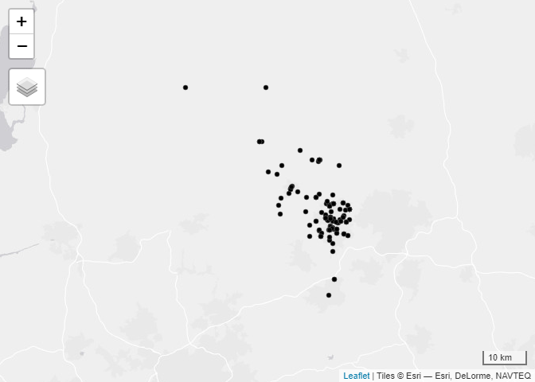
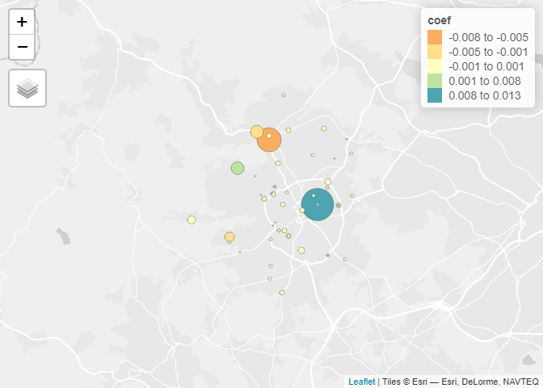
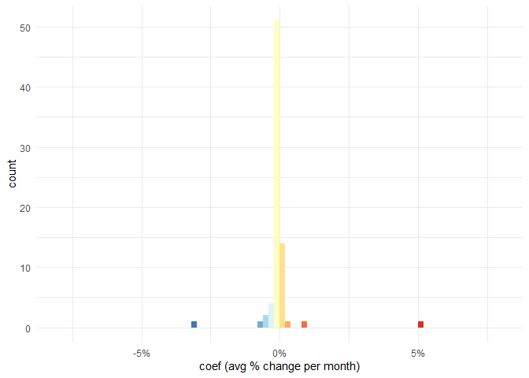
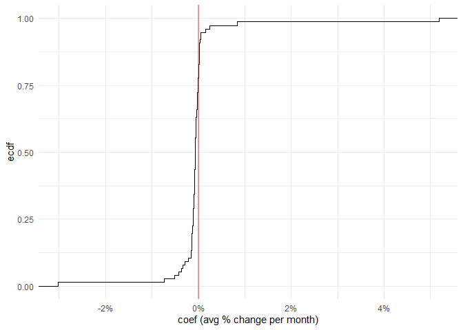

# OpenPrescription EDA
Juan Fonseca

This work is based on data from
[OpenPrescribing](https://openprescribing.net/).

## Obtaining boundaries

``` r
library(sf)
```

    Linking to GEOS 3.11.2, GDAL 3.8.2, PROJ 9.3.1; sf_use_s2() is TRUE

``` r
library(tidyverse)
```

    ── Attaching core tidyverse packages ──────────────────────── tidyverse 2.0.0 ──
    ✔ dplyr     1.1.4     ✔ readr     2.1.5
    ✔ forcats   1.0.0     ✔ stringr   1.5.1
    ✔ ggplot2   3.5.1     ✔ tibble    3.2.1
    ✔ lubridate 1.9.3     ✔ tidyr     1.3.1
    ✔ purrr     1.0.2     

    ── Conflicts ────────────────────────────────────────── tidyverse_conflicts() ──
    ✖ dplyr::filter() masks stats::filter()
    ✖ dplyr::lag()    masks stats::lag()
    ℹ Use the conflicted package (<http://conflicted.r-lib.org/>) to force all conflicts to become errors

``` r
library(tmap)
```

    Breaking News: tmap 3.x is retiring. Please test v4, e.g. with
    remotes::install_github('r-tmap/tmap')

## GP surgeries

Approximate locations of all registered GP surgeries can be obtained.
For example, for Bradford (ICB code: `36J)`

``` r
bradford_code <- "36J"
```

``` r
Bradford_Practices <- geojsonsf::geojson_sf(
  paste0("https://openprescribing.net/api/1.0/org_location/?q=",
         bradford_code)
  )
```

    Warning in readLines(con): incomplete final line found on
    'https://openprescribing.net/api/1.0/org_location/?q=36J'

``` r
tmap_mode("view")
```

    tmap mode set to interactive viewing

``` r
qtm(Bradford_Practices |> st_make_valid())
```



### Short acting beta agonist inhalers

See: <https://openprescribing.net/measure/saba/definition/>

Taken from the web:

> ***Why it matters:** Why Asthma Still Kills reports that high use of
> short acting beta agonists (salbutamol and terbutaline) and poor
> adherence to inhaled corticosteroids in asthma suggests poor control -
> these patients should be reviewed regularly to ensure good control.*
>
> *The NHS England National Medicines Optimisation Opportunities for
> 2023/24 identify improving patient outcomes from the use of inhalers
> as an area for improvement.*
>
> ***Description:** Prescribing of short acting beta agonist (SABA)
> inhalers - salbutamol and terbutaline - compared with prescribing of
> inhaled corticosteroid inhalers and SABA inhalers*

``` r
saba <- read_csv(
  paste0("https://openprescribing.net/api/1.0/measure_by_practice/?format=csv&org=",
         bradford_code,
         "&parent_org_type=ccg&measure=saba")) 
```

    Rows: 5368 Columns: 9
    ── Column specification ────────────────────────────────────────────────────────
    Delimiter: ","
    chr  (4): measure, org_type, org_id, org_name
    dbl  (4): numerator, denominator, calc_value, percentile
    date (1): date

    ℹ Use `spec()` to retrieve the full column specification for this data.
    ℹ Specify the column types or set `show_col_types = FALSE` to quiet this message.

### High dose inhaled corticosteroids

See: <https://openprescribing.net/measure/icsdose/definition/>

Taken from the web:

> ***Why it matters:** Latest BTS/SIGN guidance on the treatment of
> asthma recommends that patients should be maintained at the lowest
> possible dose of inhaled corticosteroid. Reduction in inhaled
> corticosteroid dose should be slow as patients deteriorate at
> different rates. Reductions should be considered every three months,
> decreasing the dose by approximately 25–50% each time. This measure
> uses table 12 of the BTS/SIGN guidance to define which inhalers are
> considered high-dose.*
>
> *The latest guidance for treatment of COPD now recommends use of
> another treatment in preference to inhaled corticosteroids. There is
> some evidence that inhaled corticosteroids increases the risk of
> pneumonia. This risk appears to increase with dose.*
>
> ***Description:** Prescribing of high dose inhaled corticosteroids
> compared with prescribing of all inhaled corticosteroids*

``` r
icsdose <- read_csv(
  paste0("https://openprescribing.net/api/1.0/measure_by_practice/?format=csv&org=",
  bradford_code,
  "&parent_org_type=ccg&measure=icsdose"))
```

    Rows: 5368 Columns: 9
    ── Column specification ────────────────────────────────────────────────────────
    Delimiter: ","
    chr  (4): measure, org_type, org_id, org_name
    dbl  (4): numerator, denominator, calc_value, percentile
    date (1): date

    ℹ Use `spec()` to retrieve the full column specification for this data.
    ℹ Specify the column types or set `show_col_types = FALSE` to quiet this message.

### Exploring the data

It is possible to extract the trends of both metrics. Below a graphical
extract of one of the metrics for Bradford.

``` r
head(saba)
```

    # A tibble: 6 × 9
      measure org_type org_id org_name   date       numerator denominator calc_value
      <chr>   <chr>    <chr>  <chr>      <date>         <dbl>       <dbl>      <dbl>
    1 saba    practice B83021 FARFIELD … 2019-03-01       849        1499      0.566
    2 saba    practice B82020 CROSS HIL… 2019-03-01       665        1223      0.544
    3 saba    practice B82028 FISHER ME… 2019-03-01       467        1211      0.386
    4 saba    practice B82053 DYNELEY H… 2019-03-01       436         913      0.478
    5 saba    practice B82099 GRASSINGT… 2019-03-01         0           0     NA    
    6 saba    practice B83002 ILKLEY & … 2019-03-01       109         262      0.416
    # ℹ 1 more variable: percentile <dbl>

``` r
saba |> 
  ggplot(aes(x = date,
             y = calc_value,
             groups = org_id))+
  geom_line(alpha = 0.15, col = "dodgerblue2",linewidth = 0.65)+
  stat_smooth(geom = "line",method = "lm",alpha = 0.2, col = "dodgerblue4",linewidth = 0.7)+ 
  theme_minimal()+
  labs(title = "Ratio of Prescribed SABA over inhaled corticosteroid inhalers + SABA",
       y = "value"
  )
```

    `geom_smooth()` using formula = 'y ~ x'

    Warning: Removed 1259 rows containing non-finite outside the scale range
    (`stat_smooth()`).

    Warning: Removed 1253 rows containing missing values or values outside the scale range
    (`geom_line()`).


``` r
min_date <- min(saba$date)
```

``` r
saba_processed <- saba |> 
  mutate(day = difftime(date,
                        min_date,
                        units = "weeks") |>
           as.numeric()) |>
  drop_na(calc_value) |> 
  nest(data = -org_id) |> 
  mutate(lm.model = map(.x = data,
                        \(x) {
                          lm(calc_value ~ day, data = x)
                          }),
         coef = map_dbl(lm.model,\(x){coef(x)[2]})
  )
```

This creates a circular boinding area around Bradford to identify the
relevant practices

``` r
bradford_zones <- zonebuilder::zb_zone("Bradford City",n_circles = 3)
```

Joining trends

``` r
bradford_trends <- Bradford_Practices[bradford_zones,] |>
  left_join(
    saba_processed |>
      select(org_id,coef),
    by = c("code"="org_id"))
```

Mapping the trends

``` r
base_osm <- tmaptools::read_osm(bradford_trends)

tm_shape(base_osm)+
  tm_rgb()+
  tm_shape(bradford_trends |> 
  mutate(abs.size = abs(coef))
  )+
  tm_dots(col = "coef",
          midpoint = 0,
          palette = "Spectral",
          size = "abs.size",
          style = "fisher")+tm_layout(bg.color = "gray")
```

    Legend for symbol sizes not available in view mode.

    OpenStreetMapData read with read_osm is static, so not usable in view mode. Please use tm_basemap or tm_tiles, with the provider name set to "OpenStreetMap.Mapnik"



A check of the distribution of the trends

``` r
saba_processed |> 
  ggplot(aes(coef,fill = cut(coef,
                             breaks = seq(-0.02,0.02,0.0005))))+
  geom_histogram(breaks =  seq(-0.02,0.02,0.0005))+
  theme_minimal()+
  scale_x_continuous(labels = scales::percent)+
  scale_fill_brewer(palette = "RdYlBu",direction = -1)+
  labs(x = "coef (avg % change by week)")+
  theme(legend.position = "none")
```



``` r
saba_processed |> 
  ggplot(aes(coef))+
  stat_ecdf(geom = "step")+
  theme_minimal()+
  geom_vline(xintercept = 0,alpha = 0.4,col ="red",linewidth = 1)+
  scale_x_continuous(labels = scales::percent)+
  scale_fill_brewer(palette = "RdYlBu",direction = -1)+
  labs(x = "coef (avg % change by week)")+
  theme(legend.position = "none")
```


