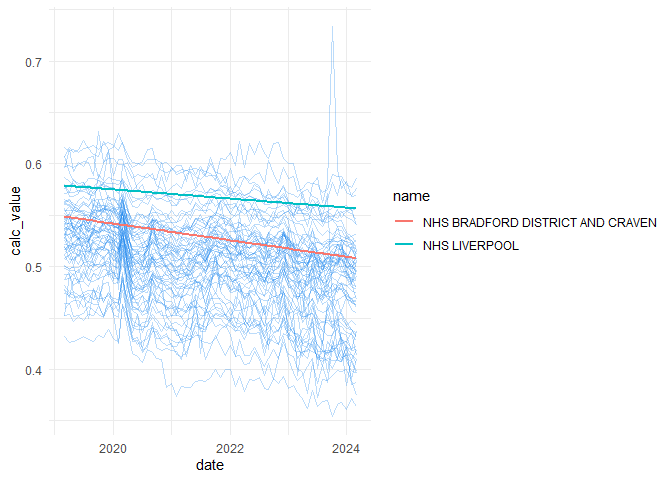

# OpenPrescription EDA
Juan Fonseca

Based on the main analysis

``` r
library(sf)
```

    Linking to GEOS 3.11.2, GDAL 3.8.2, PROJ 9.3.1; sf_use_s2() is TRUE

``` r
library(tidyverse)
```

    ── Attaching core tidyverse packages ──────────────────────── tidyverse 2.0.0 ──
    ✔ dplyr     1.1.4     ✔ readr     2.1.5
    ✔ forcats   1.0.0     ✔ stringr   1.5.1
    ✔ ggplot2   3.5.1     ✔ tibble    3.2.1
    ✔ lubridate 1.9.3     ✔ tidyr     1.3.1
    ✔ purrr     1.0.2     

    ── Conflicts ────────────────────────────────────────── tidyverse_conflicts() ──
    ✖ dplyr::filter() masks stats::filter()
    ✖ dplyr::lag()    masks stats::lag()
    ℹ Use the conflicted package (<http://conflicted.r-lib.org/>) to force all conflicts to become errors

``` r
library(tmap)
```

    Breaking News: tmap 3.x is retiring. Please test v4, e.g. with
    remotes::install_github('r-tmap/tmap')

## NHS boundaries

boundaries for the NSH regions

``` r
CCG_boundaries <- geojsonsf::geojson_sf("https://openprescribing.net/api/1.0/org_location/?org_type=ccg") |> st_transform(27700)
```

    Warning in readLines(con): incomplete final line found on
    'https://openprescribing.net/api/1.0/org_location/?org_type=ccg'

## Loading the built-up areas

Reading the built-up areas data

``` r
builtup_bounds <- st_read("OS Open Built Up Areas.gpkg",
                          layer = "os_open_built_up_areas")
```

    Reading layer `os_open_built_up_areas' from data source 
      `C:\Users\ts18jpf\OneDrive - University of Leeds\03_PhD\00_Misc_projects\Eng-Presc-Data\OS Open Built Up Areas.gpkg' 
      using driver `GPKG'
    Simple feature collection with 8585 features and 7 fields
    Geometry type: MULTIPOLYGON
    Dimension:     XY
    Bounding box:  xmin: 65300 ymin: 10000 xmax: 655625 ymax: 1177650
    Projected CRS: OSGB36 / British National Grid

## Running the analisys for all regions

``` r
all_data <- do.call(bind_rows,
                    lapply(CCG_boundaries$code,\(t_code){
  
  # Subsetting the biggest built-up NHS area
  main_BA <- builtup_bounds[CCG_boundaries[CCG_boundaries$code==t_code,],] |>
    slice_max(geometry_area_m) 

  # Extracting the practices for that NHS area
    Practices <- geojsonsf::geojson_sf(
      paste0("https://openprescribing.net/api/1.0/org_location/?q=",
         t_code)) |>
      st_transform(27700)
    
    # Extracting the SABA results for that area
    
    saba <- read_csv(
      paste0("https://openprescribing.net/api/1.0/measure_by_practice/?format=csv&org=",
         t_code,
         "&parent_org_type=ccg&measure=saba"))
    
    # Identifying the practices with more than 10 records
    ids_to_include <- saba |>
      drop_na() |>
      summarise(n_reports = n(), .by = org_id) |>
      arrange(n_reports) |>
      filter(n_reports > 10) |>
      pull(org_id)
  
    # Defining function for month delta
    diff_month <- function(start, end){
      length(seq(from=start, to=end, by='month')) - 1
      }
    
    # Doing all the month transforming for fitting a model
    start_month <- min(saba$date)
    saba$month <- vapply(saba$date,\(x){
      diff_month(start_month,x)},numeric(1))
    
    # Identifying the practices within the main built-up area
    city_practices <- Practices[main_BA,] |> pull(code)
    
    # Producing a clean SABA dataset (no outliers nor practices out of main urban area)
    clean_data <- saba |>
      filter(org_id %in% ids_to_include,
             org_id %in% city_practices)
    
    clean_data |>
      summarise(across(numerator:denominator,sum),
                .by = c(date, month)) |> 
      mutate(calc_value = numerator/denominator,
             org_code  = t_code)
    }
  )
)
```

``` r
all_data_names <- all_data |>
  left_join(CCG_boundaries |>
              st_drop_geometry() |>
              select(name,code),by = c("org_code"="code"))
```

A quick visualisation of the trends of Bradford and Liverpool

``` r
all_data_names|> 
  ggplot(aes(x = date,y = calc_value,group = org_code))+
  geom_line(col = "dodgerblue2",alpha = 0.3)+
  geom_smooth(data =all_data_names |> 
                filter(org_code %in% c("36J","99A")),
              aes(col = name),
              method = "lm",se = F,
              # col = "dodgerblue4",
              linewidth = 1)+
  theme_minimal()
```

    `geom_smooth()` using formula = 'y ~ x'


