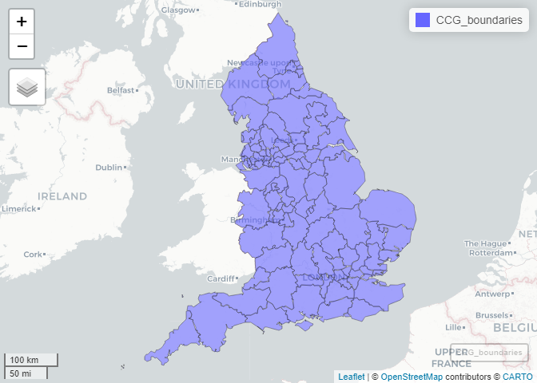
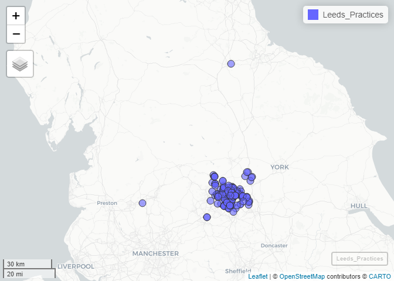
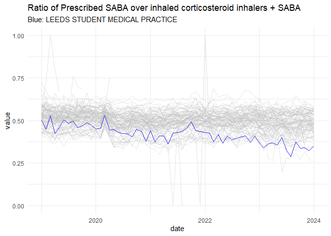

# OpenPrescription EDA
Juan Fonseca

This work is based on data from
[OpenPrescribing](https://openprescribing.net/).

## Obtaining boundaries

``` r
library(sf)
```

    Linking to GEOS 3.11.2, GDAL 3.8.2, PROJ 9.3.1; sf_use_s2() is TRUE

``` r
library(tidyverse)
```

    ── Attaching core tidyverse packages ──────────────────────── tidyverse 2.0.0 ──
    ✔ dplyr     1.1.4     ✔ readr     2.1.5
    ✔ forcats   1.0.0     ✔ stringr   1.5.1
    ✔ ggplot2   3.5.0     ✔ tibble    3.2.1
    ✔ lubridate 1.9.3     ✔ tidyr     1.3.1
    ✔ purrr     1.0.2     

    ── Conflicts ────────────────────────────────────────── tidyverse_conflicts() ──
    ✖ dplyr::filter() masks stats::filter()
    ✖ dplyr::lag()    masks stats::lag()
    ℹ Use the conflicted package (<http://conflicted.r-lib.org/>) to force all conflicts to become errors

## Boundaries of all Sub-ICB Locations

Practices are grouped in sub-ICB. The following code extracts the
boundaries for all ICBs in the country

``` r
CCG_boundaries <- geojsonsf::geojson_sf("https://openprescribing.net/api/1.0/org_location/?org_type=ccg")
```

    Warning in readLines(con): incomplete final line found on
    'https://openprescribing.net/api/1.0/org_location/?org_type=ccg'

``` r
mapview::mapview(CCG_boundaries)
```



## GP surgeries

Approximate locations of all registered GP surgeries can be obtained.
For example, for Leeds (ICB code: `15F)`

``` r
Leeds_Practices <- geojsonsf::geojson_sf("https://openprescribing.net/api/1.0/org_location/?q=15F")
```

    Warning in readLines(con): incomplete final line found on
    'https://openprescribing.net/api/1.0/org_location/?q=15F'

``` r
mapview::mapview(Leeds_Practices)
```



## Getting data of respiratory `tag` for Leeds

There are two relevant metrics which are readily available:

- Short acting beta agonist inhalers

- High dose inhaled corticosteroids

The metrics are produced for each month. Producing a moving average is
possible but it will requires to build the database with the raw data,
also prescriptions have been normalised in the processed dataset.

### Short acting beta agonist inhalers

See: <https://openprescribing.net/measure/saba/definition/>

Taken from the web:

> ***Why it matters:** Why Asthma Still Kills reports that high use of
> short acting beta agonists (salbutamol and terbutaline) and poor
> adherence to inhaled corticosteroids in asthma suggests poor control -
> these patients should be reviewed regularly to ensure good control.*
>
> *The NHS England National Medicines Optimisation Opportunities for
> 2023/24 identify improving patient outcomes from the use of inhalers
> as an area for improvement.*
>
> ***Description:** Prescribing of short acting beta agonist (SABA)
> inhalers - salbutamol and terbutaline - compared with prescribing of
> inhaled corticosteroid inhalers and SABA inhalers*

``` r
saba <- read_csv("https://openprescribing.net/api/1.0/measure_by_practice/?format=csv&org=15F&parent_org_type=ccg&measure=saba")
```

    Rows: 6832 Columns: 9
    ── Column specification ────────────────────────────────────────────────────────
    Delimiter: ","
    chr  (4): measure, org_type, org_id, org_name
    dbl  (4): numerator, denominator, calc_value, percentile
    date (1): date

    ℹ Use `spec()` to retrieve the full column specification for this data.
    ℹ Specify the column types or set `show_col_types = FALSE` to quiet this message.

### High dose inhaled corticosteroids

See: <https://openprescribing.net/measure/icsdose/definition/>

Taken from the web:

> ***Why it matters:** Latest BTS/SIGN guidance on the treatment of
> asthma recommends that patients should be maintained at the lowest
> possible dose of inhaled corticosteroid. Reduction in inhaled
> corticosteroid dose should be slow as patients deteriorate at
> different rates. Reductions should be considered every three months,
> decreasing the dose by approximately 25–50% each time. This measure
> uses table 12 of the BTS/SIGN guidance to define which inhalers are
> considered high-dose.*
>
> *The latest guidance for treatment of COPD now recommends use of
> another treatment in preference to inhaled corticosteroids. There is
> some evidence that inhaled corticosteroids increases the risk of
> pneumonia. This risk appears to increase with dose.*
>
> ***Description:** Prescribing of high dose inhaled corticosteroids
> compared with prescribing of all inhaled corticosteroids*

``` r
icsdose <- read_csv("https://openprescribing.net/api/1.0/measure_by_practice/?format=csv&org=15F&parent_org_type=ccg&measure=icsdose")
```

    Rows: 6832 Columns: 9
    ── Column specification ────────────────────────────────────────────────────────
    Delimiter: ","
    chr  (4): measure, org_type, org_id, org_name
    dbl  (4): numerator, denominator, calc_value, percentile
    date (1): date

    ℹ Use `spec()` to retrieve the full column specification for this data.
    ℹ Specify the column types or set `show_col_types = FALSE` to quiet this message.

### Exploring the data

It is possible to extract the trends of both metrics. Below a graphical
extract of one of the metrics for Leeds.

``` r
head(saba)
```

    # A tibble: 6 × 9
      measure org_type org_id org_name   date       numerator denominator calc_value
      <chr>   <chr>    <chr>  <chr>      <date>         <dbl>       <dbl>      <dbl>
    1 saba    practice B86031 WESTFIELD… 2019-01-01       144         242      0.595
    2 saba    practice B86002 CITY VIEW… 2019-01-01       534         977      0.547
    3 saba    practice B86003 DR G LEES… 2019-01-01       636        1182      0.538
    4 saba    practice B86004 HIGHFIELD… 2019-01-01       322         660      0.488
    5 saba    practice B86005 DR N DUMP… 2019-01-01       183         387      0.473
    6 saba    practice B86006 OULTON ME… 2019-01-01       656        1207      0.543
    # ℹ 1 more variable: percentile <dbl>

``` r
saba |> 
  ggplot(aes(x = date,
             y = calc_value,
             groups = org_id,
             col = mycol,
             alpha = myalpha))+
  geom_line(alpha = 0.4, col = "gray")+
  geom_line(data = saba[grep(pattern = "STUDENT",saba$org_name),],
            col = "blue",
            alpha = 0.8)+
  theme_minimal()+
  labs(title = "Ratio of Prescribed SABA over inhaled corticosteroid inhalers + SABA",
       y = "value",
       subtitle = "Blue: LEEDS STUDENT MEDICAL PRACTICE"
  )
```

    Warning: Removed 1157 rows containing missing values or values outside the scale range
    (`geom_line()`).


